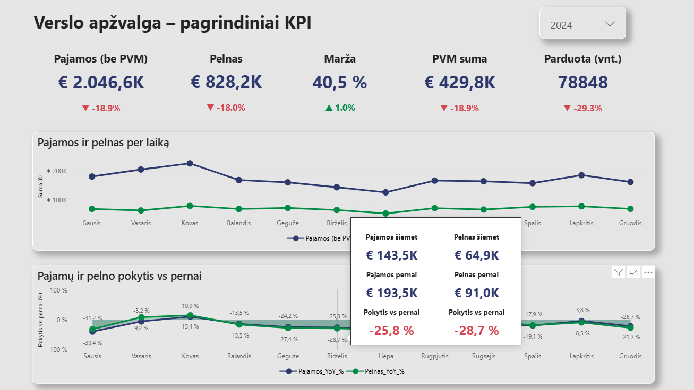
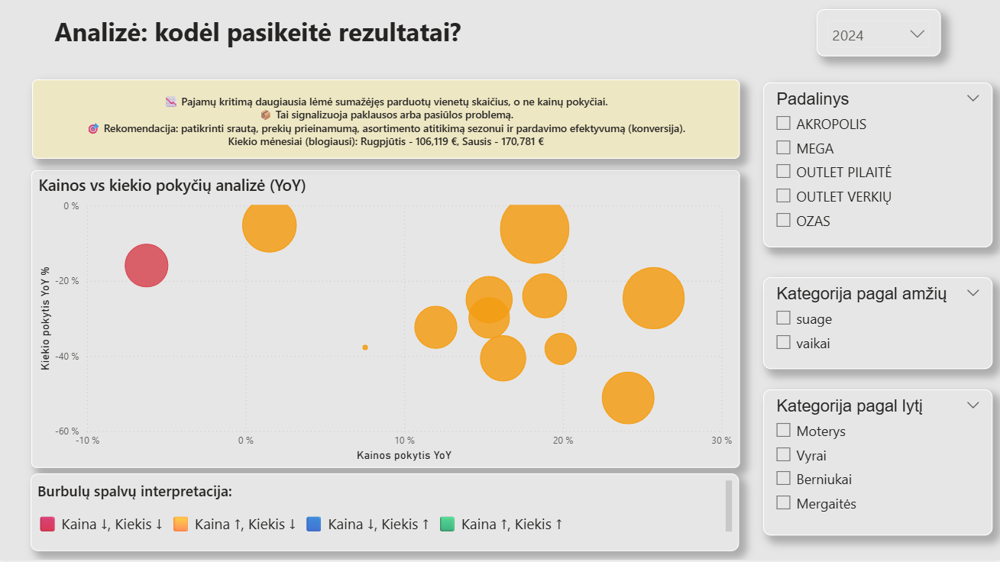
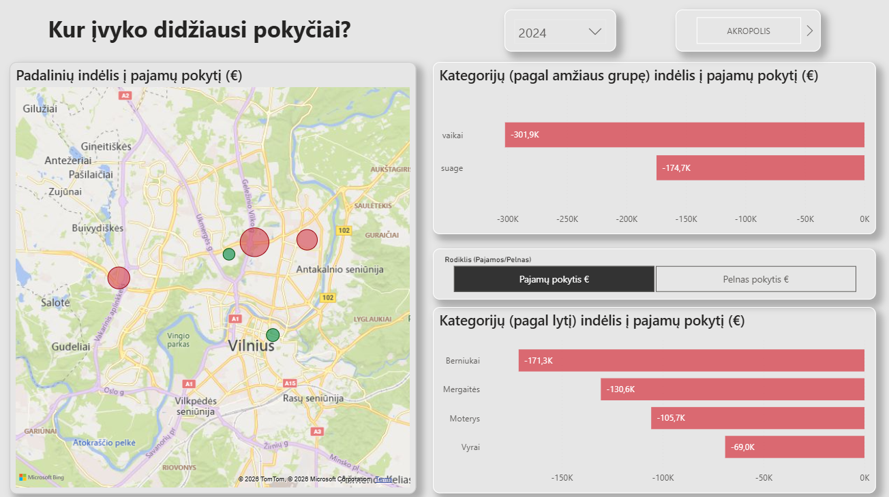

# Power BI – Sales Performance Analysis

## Project Overview
This Power BI project analyzes retail sales performance and identifies the key drivers behind revenue and profit changes.

The dashboard is designed for management-level decision support and answers three core business questions:
- What changed in business performance?
- Why did the results change?
- Where did the biggest impact occur?

## Key KPIs
The main KPIs used in the analysis:
- Revenue (excluding VAT)
- Profit
- Margin %
- VAT amount
- Units sold

All KPIs are analyzed year-over-year (YoY).

## Analysis Highlights
- Revenue decline was primarily driven by a decrease in sold quantities rather than price reductions.
- Price vs quantity analysis highlights categories where price increases did not offset volume losses.
- The largest negative impact came from specific store locations and customer segments (age and gender groups).
- Store, category, and demographic analysis helps identify areas requiring corrective actions.

## Dashboard Pages
1. **Business Overview** – key KPIs and performance trends  
2. **Why Did Results Change?** – price vs quantity impact analysis  
3. **Where Did Changes Occur?** – store, category, age group, and gender contribution analysis  

## Tools & Skills Demonstrated
- Power BI Desktop
- DAX measures (YoY, variance, contribution analysis)
- Business-oriented data visualization
- Analytical thinking and data storytelling

---

## Dashboard Screenshots

### 1. Business Overview – Key KPIs

This page provides a high-level overview of business performance, including revenue, profit, margin, VAT, and units sold, with year-over-year comparison.

---

### 2. Why Did Results Change? – Price vs Quantity Analysis

This analysis explains performance changes by separating price and quantity effects and identifying categories where volume decline was the main driver.

---

### 3. Where Did Changes Occur? – Store & Customer Segment Impact

This page highlights which store locations and customer segments (age and gender groups) had the largest impact on overall performance.
